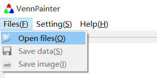

#User Manual
##1.Run-time Environment
###1.1 Hardware
VennPainter was developed by using Qt 4.8.5 under its LGPL v2.1 license. This software had been  tested on Win xp,Win 7,Win 8,Linux Mint 13,Mac OS 10.8.5.
Minimum requirement: PC (PIII866)，512M memory，20G Hard disk

###2.2 System
Operating system：Windows xp or higher，Linux with GUI, Mac OS 10.8.5 or higher.

##2. Load data
###.1 Input data format
Each input set should be a text file. Every element should be separated by white space characters (space, tab, and newline) in the set. If an element displays multiple times in a file, it will be analyzed as one element only. About the processing capability, data with no more than eight sets could be analyzed and output with both diagrams and text files. As for data sets ranging from 9 to 31, only a text-based output format could be generated. VennPainter supports three text-based format (e.g., vertical, horizontal and matrix) for further analysis.

###2.2 Load data
Data can be loaded with "Files"->"Open Files"(Fig. 1). This application allows one or more files to be loaded at once.

**Fig. 1** open files menu
##3. Customize image and data
###3.1 Options for color or the number of sets
After loading data, a control panel will appear on the left with check-box and color button in pairs (Fig. 2). The loaded sets could be selected or unselected by clicking check-box. The corresponding color in the image could be changed by the color button. The color information can be saved by “Setting”->”Save config”. The saved color information could be loaded by “Setting”->”Load config”.

**Fig. 2** Check-box and Color button in pairs
###3.2 Switch among Classic, Edwards' and Nested Venn diagrams
VennPainter provides three types of Venn diagram (Classic Venn, Edwards’ Venn and Nested Venn) for diagram options. In our design, the Classic Venn, Edward’s Venn and Nested Venn could respectively display the sharing relationships at most five, six and eight datasets with diagram output. After diagram displayed, users can use right-click menu to switch among the three diagram options when they are available (Fig. 3a). There is an icon ahead the selected modes.. If the mode is unavailable, the item in the right-click menu turns grey and cannot be selected (Fig. 3b). The number of sets determines whether the mode is valid (Table 1). 
**a**
