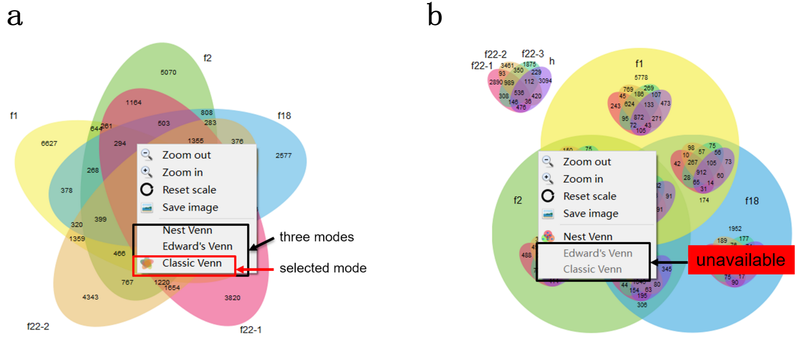
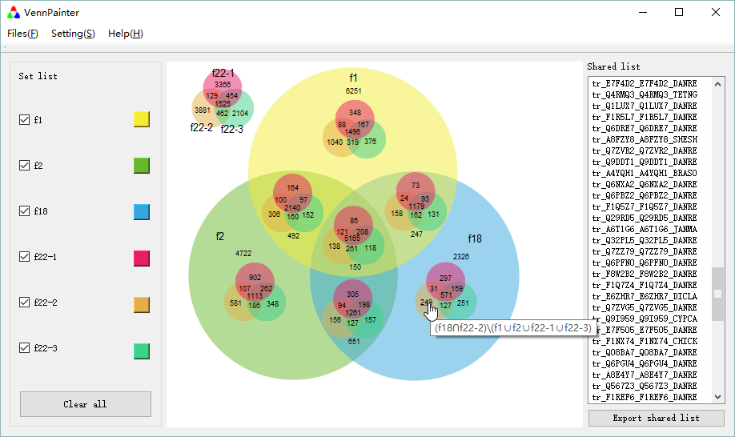
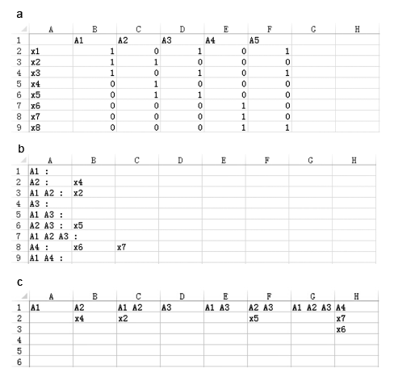

# User Manual
## 1.Run-time Environment
### 1.1 Hardware
VennPainter was developed by using Qt 4.8.5 under its LGPL v2.1 license. This software had been  tested on Win xp,Win 7,Win 8,Linux Mint 13,Mac OS 10.8.5.
Minimum requirement: PC (PIII866)，512M memory，20G Hard disk

### 1.2 System
Operating system：Windows xp or higher，Linux with GUI, Mac OS 10.8.5 or higher.

## 2.Input data
### 2.1 Input data format
Each input set should be a text file. Every element should be separated by white space characters (space, tab, and newline) in the set. If an element displays multiple times in a file, it will be analyzed as one element only. About the processing capability, data with no more than eight sets could be analyzed and output with both diagrams and text files. As for data sets ranging from 9 to 31, only a text-based output format could be generated. VennPainter supports three text-based format (e.g., vertical, horizontal and matrix) for further analysis.

### 2.2 Load data
Data can be loaded with "Files"->"Open Files"(Fig. 1). This application allows one or more files to be loaded at once.  
  
**Fig. 1** open files menu  
## 3. Customize image and data  
### 3.1 Options for color or the number of sets  
After loading data, a control panel will appear on the left with check-box and color button in pairs (Fig. 2). The loaded sets could be selected or unselected by clicking check-box. The corresponding color in the image could be changed by the color button. The color information can be saved by “Setting”->”Save config”. The saved color information could be loaded by “Setting”->”Load config”.  
  
**Fig. 2** Check-box and Color button in pairs
### 3.2 Switch among Classic, Edwards' and Nested Venn diagrams  
VennPainter provides three types of Venn diagram (Classic Venn, Edwards’ Venn and Nested Venn) for diagram options. In our design, the Classic Venn, Edward’s Venn and Nested Venn could respectively display the sharing relationships at most five, six and eight datasets with diagram output. After diagram displayed, users can use right-click menu to switch among the three diagram options when they are available (Fig. 3a). There is an icon ahead the selected modes.. If the mode is unavailable, the item in the right-click menu turns grey and cannot be selected (Fig. 3b). The number of sets determines whether the mode is valid (Table 1).   
  
**Fig. 3** right-click menus of the two diagrams.  
<table  class="table table-bordered table-striped table-condensed" border="1" align="center">
    <caption><b>Table 1</b> Capacity of Venn diagram in VennPainter </caption>
          <tr align="center">
          <th width="">Number of sets</th>
          <th >1</th>
          <th>2</th>
          <th>3</th>
          <th>4</th>
          <th>5</th>
          <th>6</th>
          <th>7</th>
          <th>8</th>
          <th>9&#126;31</th>
          </tr>
          <tr align="center">
          <th>Classic</th>
          <td>&#8730;</td>
          <td>&#8730;</td>
          <td>&#8730;</td>
          <td>&#8730;</td>
          <td>&#8730;</td>
          <td>&#215;</td>
          <td>&#215;</td>
          <td>&#215;</td>
          <td>&#215;</td>
          </tr>
          <tr align="center">
          <th>Edwards'</th>
          <td>&#215;</td>
          <td>&#8730;</td>
          <td>&#8730;</td>
          <td>&#8730;</td>
          <td>&#8730;</td>
          <td>&#8730;</td>
          <td>&#215;</td>
          <td>&#215;</td>
          <td>&#215;</td>
          </tr>
          <tr align="center">
          <th>Nested</th>
          <td>&#215;</td>
          <td>&#215;</td>
          <td>&#215;</td>
          <td>&#215;</td>
          <td>&#8730;</td>
          <td>&#8730;</td>
          <td>&#8730;</td>
          <td>&#8730;</td>
          <td>&#215;</td>
          </tr>
          </table>
### 3.3 View single intersection
VennPainter allows users view a single intersection on the diagram when the numbers of sets are no more than eight. When the mouse stays over a number on the image, the corresponding tooltip will show the logic relationship of the intersection (Fig. 4). The list of sharing elements will appear on the right of the program after users click the corresponding number. The list contains all the elements that belong to the corresponding intersection.
  
**Fig. 4** Data output for single intersection.  
## 4. Export data
### 4.1 Export image
VennPainter only support SVG images output. VennPainter save images with "Files"->"Save image" or "right-click menu"->"Save image". The SVG images could be read and modified by many graphic vector editors, such as Adobe Illustrator, Inkscape and CorelDRAW, etc.

### 4.2 Export shared data
VennPainter provides three text-based formats for shared datasets, including vertical format, horizontal format and matrix format( Fig. 5). In the Matrix format (Fig. 5a), the first row contains all datasets, and the first column contains all elements from all datasets. Other columns indicate if the element existing in each dataset: “1” indicate yes, while “0” indicate no. In the Vertical format (Fig. 5b), each row contains the elements belonging to each intersection. For example, a six-set Venn diagram has 63 intersections and thus, the text file contains 63 rows, each rows contains all the elements belonging to each intersection. Horizontal format (Fig. 5c) is identical to the vertical mode except for the exchange of columns and rows.
  
**Fig. 5** output dataset  
### 4.3 Export single intersection
Moving mouse pointer over the number on the image, the tooltip will show the corresponding relationship of the intersection. If clicking the number, the shared list will appear on the right panel. The shared list can be exported as a text file by clicking the “Export shared list”( Fig. 4).
## 5. Other Operations
### 5.1 Clear all data
The data can be cleared by clicking the “Clear All” button. After clearing all data, other datasets can be loaded to construct a new Venn diagram.
## 6. Prebuilt binaries  
[VennPainter_1.2.0.exe for windows](http://www.linguoliang.net/blog/download/VennPainterinstaller_V1.2.0.exe)

[VennPainter_v1.2.0.dmg for Mac OS](http://www.linguoliang.net/blog/download/VennPainter_v1.2.0.dmg)

[VennPainter_V1.2.0_x86.tar.gz for linux x86](http://www.linguoliang.net/blog/download/VennPainter_V1.2.0_x86.tar.gz)

[VennPainter_V1.2.0_x64.tar.gz for linux x64](http://www.linguoliang.net/blog/download/VennPainter_V1.2.0_x64.tar.gz)
## Citation
[Lin G, Chai J, Yuan S, Mai C, Cai L, et al. (2016) VennPainter: A Tool for the Comparison and Identification of Candidate Genes Based on Venn Diagrams. PLoS ONE 11(4): e0154315. doi: 10.1371/journal.pone.0154315](http://journals.plos.org/plosone/article?id=10.1371/journal.pone.0154315)
